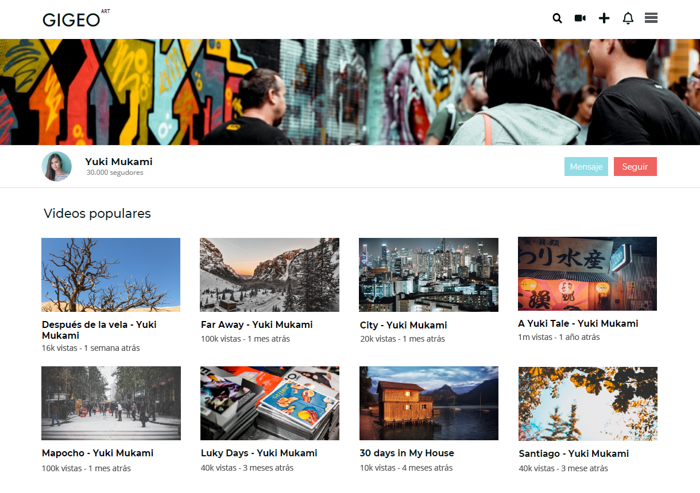

<!DOCTYPE html>
<html>

<head>
  <meta charset="utf-8">
  <meta name="viewport" content="width=device-width, initial-scale=1.0">
  <link rel="stylesheet" href="https://stackedit.io/style.css" />
</head>

<body class="stackedit">
  

    <h1 id="github-pages">Github pages</h1>
    
<a href="https://josefamendezpruebaunodl.ga/Unidad_2/2_4_Flexbox/GIGEO_JosefaMendezGomez/index.html">Vista del proyecto</a>

    <h1 id="desafío">Descripción </h1>
    
GIGEO APP es una plataforma de video la cual promueve y difunde el cine arte dándole la
oportunidad a realizadores de presentar sus largometrajes y cortometrajes de manera fácil y
visual a usuarios de todo el mundo.
Esta aplicación se encuentra en fase de renovación de su interfaz y te piden a tí ser el
encargado de traspasar el diseño del mockup a una maqueta desarrollada en HTML y CSS.
Para poder realizar esta tarea te hacen entrega de tres piezas gráficas: La primera es el
mockup de con la interfaz de dispositivos móviles, seguido de otra representación visual
con el mismo contenido, pero para dispositivos de escritorio y una guía de estilos con
algunos elementos usados en el diseño.
Asimismo, en este mismo archivo comprimido se encuentran las imágenes usadas en el
interior de la interfaz de usuario.

 
  

</body>

</html>
