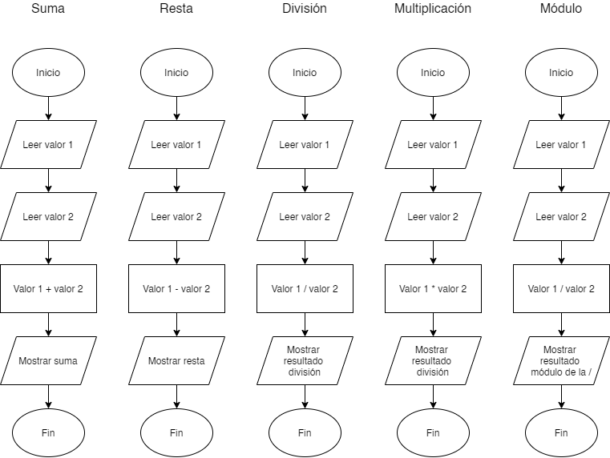

<!DOCTYPE html>
<html>

<head>
  <meta charset="utf-8">
  <meta name="viewport" content="width=device-width, initial-scale=1.0">
  <link rel="stylesheet" href="https://stackedit.io/style.css" />
</head>

<body class="stackedit">
  

    <h1 id="desafío">Desafío 1 </h1>
    
Realizar el diagrama de flujo para las siguientes operaciones matemáticas: Suma, Resta, División, Multiplicación y el módulo de un número, partiendo de dos números ingresados por el usuario.

    

  

</body>

</html>
