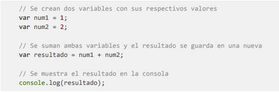

<!DOCTYPE html>
<html>

<head>
  <meta charset="utf-8">
  <meta name="viewport" content="width=device-width, initial-scale=1.0">
  <link rel="stylesheet" href="https://stackedit.io/style.css" />
</head>

<body class="stackedit">
  

    <h1 id="github-pages">Github pages</h1>
    
<a href="https://josefamendezpruebaunodl.ga/Unidad_2/Prueba/Prueba_JosefaMendezGomez/index.html">Vista
        del proyecto</a>

    <h1 id="desafío">Descripción </h1>
    
En tus tareas en el desarrollo web, te encontrarás con la necesidad de responder a diversos requerimientos. En esta ocasión, tu trabajo será resolver, con los conocimientos que has adquirido, una serie de cálculos matemáticos que se necesitan diagramar y/o programar según corresponda.
    Para ello debes usar Javascript y comentar el código explicando paso a paso lo que se está
    ejecutando. Por ejemplo:

    
    <h1>Desafíos</h1>
    <ol>
        <li>Realizar el diagrama de flujo para las siguientes operaciones matemáticas: Suma,
        Resta, División, Multiplicación y el módulo de un número, partiendo de dos números
        ingresados por el usuario.
        </li>
         
        <li>
        Realizar operaciones con dos números.
         
        Pedir al usuario que ingrese dos números diferentes y mayores a cero. Para ambos
        números, calcular lo siguiente:
        <ul>
        <li>
        Suma 
        </li>
        <li>
        Resta 
        </li>
        <li>
        División 
        </li>
        <li>
        Multiplicación 
        </li>
        <li>
        Módulo 
        </li>
        </ul>
        </li>
         
        <li>
        Crear un programa que pida al usuario ingresar la temperatura en grados Celsius y
        que la transforme a grados Kelvin y Fahrenheit.
         
        Se debe considerar la siguiente información respecto a la equivalencia de las
        escalas de temperatura:
        <ul>
        <li>
        0 Grados Celsius corresponden a 273,15 Kelvin. La fórmula para convertirlos
        es 
         
        <pre><code>0 °C + 273.15 = 273.15 K
        </code></pre>
        </li>
        <li>
        0 Grados Celsius corresponden a 32 Fahrenheit. La fórmula para convertirlos
        es 
         
        <pre><code>(0 °C × 9/5) + 32 = 32 °F
        </code></pre>
        </li>
        </ul>
        </li>
         
        <li>
        Crear un programa que pida al usuario una cantidad de días y que muestre su
        equivalente en Años, Semanas y Días. Por ejemplo, si el usuario ingresa 373, el
        resultado debe ser 1 año, 1 semana y 1 día.
        Se debe considerar lo siguiente:
        <ul>
        <li>
        1 año tiene 365 días
        </li>
        <li>
        1 semana tiene 7 días
        </li>
        </ul>
        Se recomienda usar la función Math.floor para obtener la parte entera de un número
        decimal.
        </li>
         
        <li>
        Crear un programa que solicite al usuario 5 números y realice los cálculos que se
        piden a continuación.
        <ul>
        <li>
        La suma de todos los números.
        </li>
        <li>
        El promedio de los 5 números ingresados
        </li>
        </ul>
        </li>
    </ol>
  

</body>

</html>
