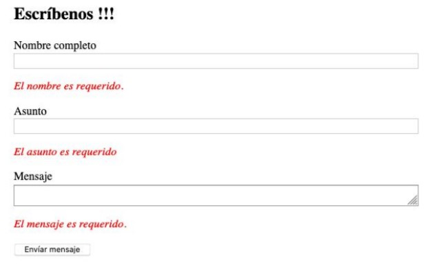
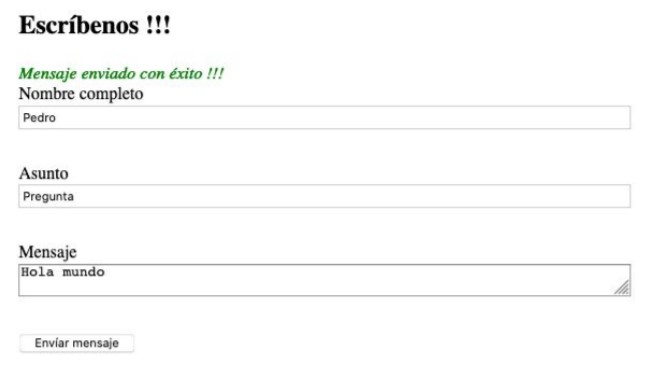
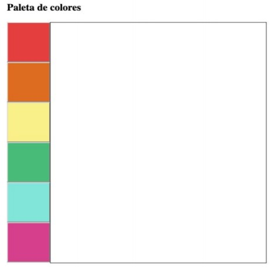
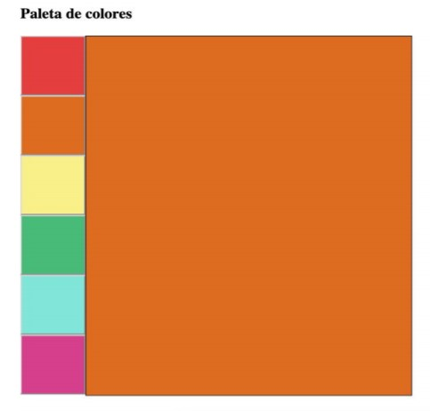

<!DOCTYPE html>
<html>

<head>
  <meta charset="utf-8">
  <meta name="viewport" content="width=device-width, initial-scale=1.0">
  <link rel="stylesheet" href="https://stackedit.io/style.css" />
</head>

<body class="stackedit">
  

    <h1 id="github-pages">Github pages</h1>
    
<a href="https://josefamendezpruebaunodl.ga/Unidad_3/3_1_VariablesYOperadoresLogicos/index.html">Vista
        del proyecto</a>

    <h1 id="desafío">Descripción </h1>
    
En tus tareas como desarrollador/a no sólo tendrás que escribir código desde 0, sino que
      muchas veces tendrás que completar tareas junto con tu equipo de trabajo, colaborando
      con las habilidades que cada uno posee para construir el proyecto solicitado.
       
       
      En uno de los proyectos que se están trabajando en la empresa, ya se ha resuelto el código
      HTML por un integrante del equipo de trabajo, y te solicitan incluir la lógica de JavaScript
      para terminar los requerimientos.
       
       
      En el siguiente desafío pondremos en práctica el uso de listener y selectores para manipular
      los elementos del DOM, ya sea para cambiar sus estilos o añadir mensajes informativos
      para el usuario a la hora de completar un formulario que permitan validar de manera rápida y
      sencilla los datos ingresados por el usuario.
      

    <h1>Requerimientos</h1>
    <ol>
        <li>Desarrollar un código para validar un formulario de contacto utilizando el evento
            submit y las expresiones regulares que permitan el ingreso de caracteres desde la
            “A-a” hasta la “Z-z” mediante el método test() de JavaScript, mostrando un mensaje
            de error y/o éxito cuando corresponda. Es decir, el usuario deberá obligatoriamente
            ingresar datos en el formulario y que estos solo sean caracteres alfabéticos de la “a”
            hasta la “z” para poder enviar la información. Como se muestra en las siguientes
            imágenes:
             
             
            
             
             
            
        </li>
         
        <li>
        A partir de un selector de colores, cambia el color del cuadro principal al hacer click
        sobre uno de los colores. Ver las siguientes imágenes:
         
         
        
         
         
        
         
        <li>
        Dar la funcionalidad de sumar y restar a la calculadora, mostrando el resultado en el
        elemento con clase resultado. Si el resultado de la resta entrega un número negativo
        debes mostrar un 0.
        </li>
    </ol>
  

</body>

</html>
